# EcommerceApp

EcommerceApp is a modern e-commerce application built using React, Node.js, Express, MySQL, Sequelize, and Material-UI. It provides users with the ability to browse products, manage their shopping cart, and place orders. The app also includes an admin panel for managing products, users, and orders.

## Screenshots
*Sign-up page for new customers.*
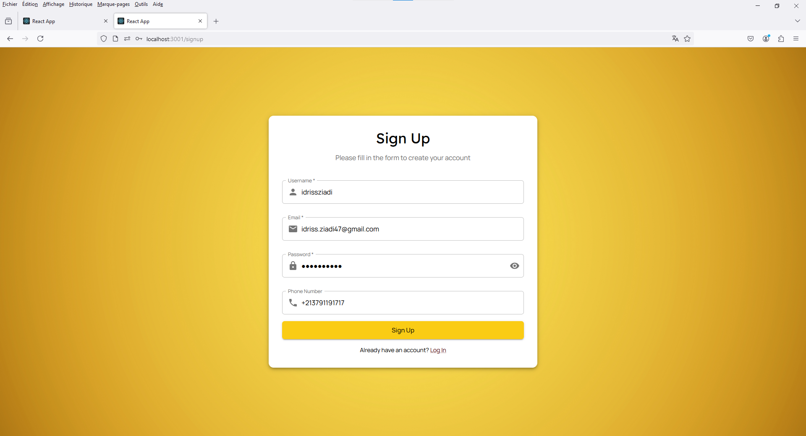

*Customer login page.*
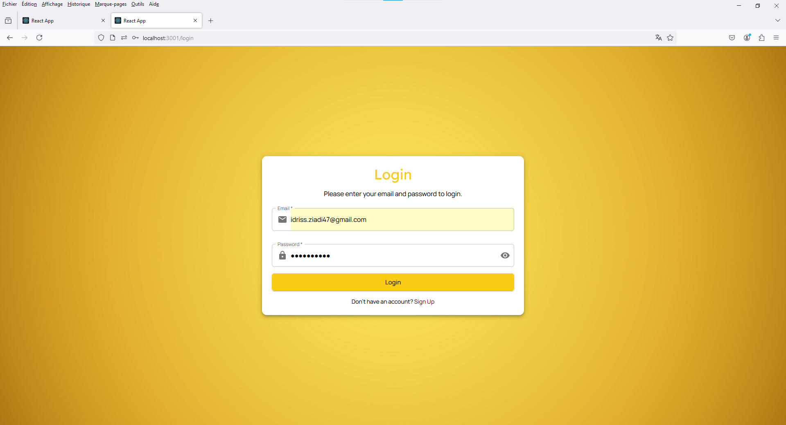

*Categories displayed in a grid layout.*
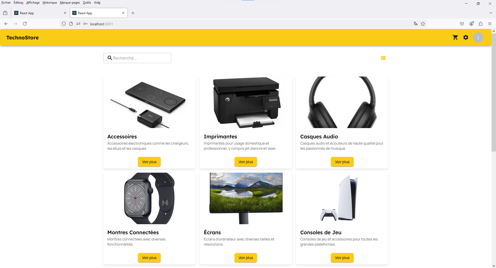

*Categories displayed in a list layout.*
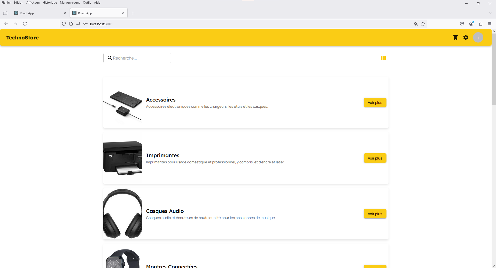

*Grid view of available products.*


*Product grid with a filter sidebar.*
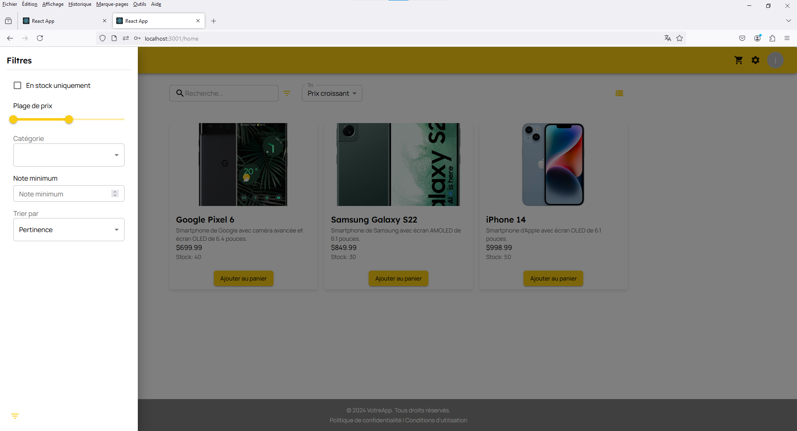

*List view of available products.*
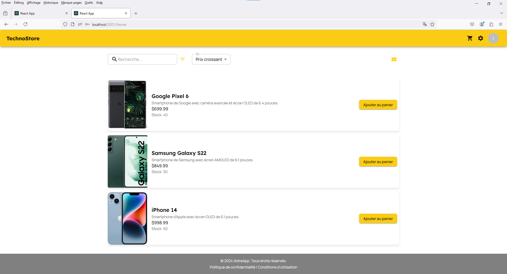

*Shopping cart showing added items.*
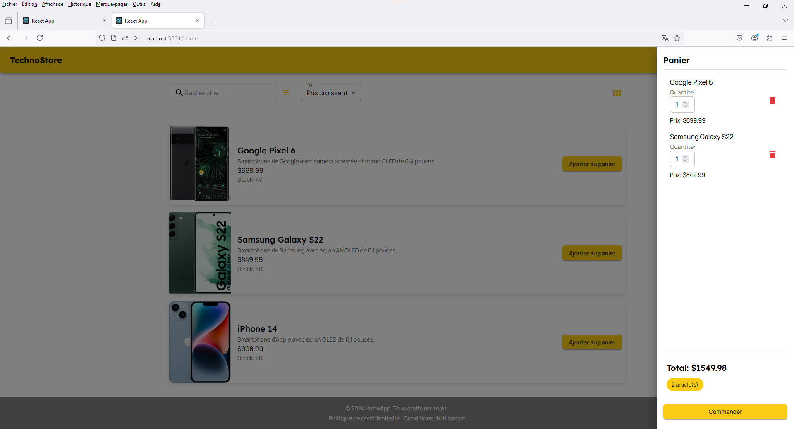

*Order invoice view.*
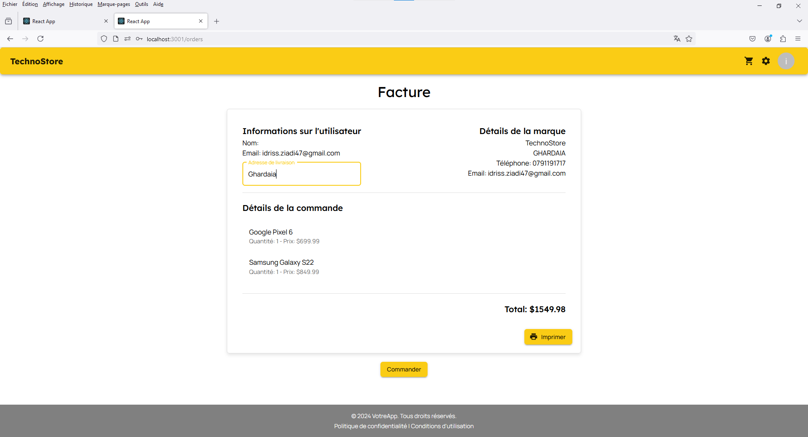

*Invoice printing page.*
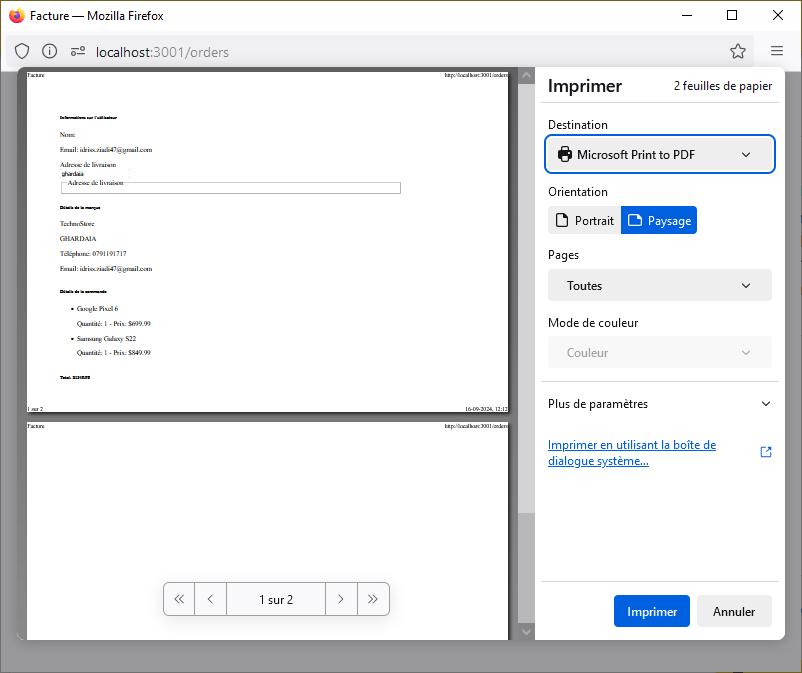

*Admin login page.*
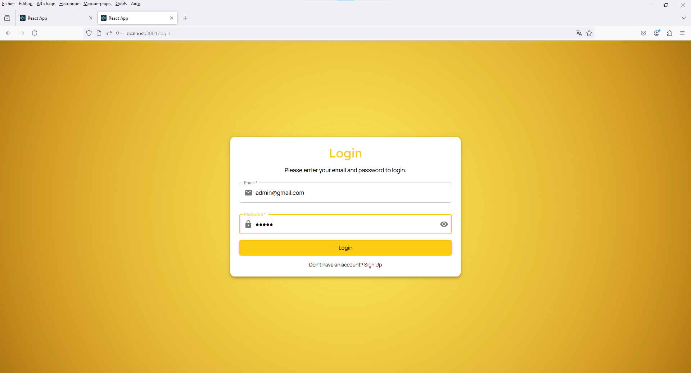

*Admin dashboard for managing orders and products.*
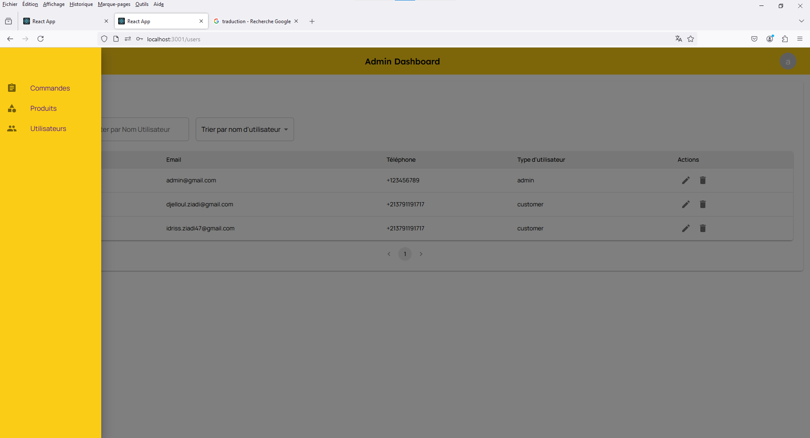

*Admin dashboard showing a list of orders.*


*Order details including user information.*
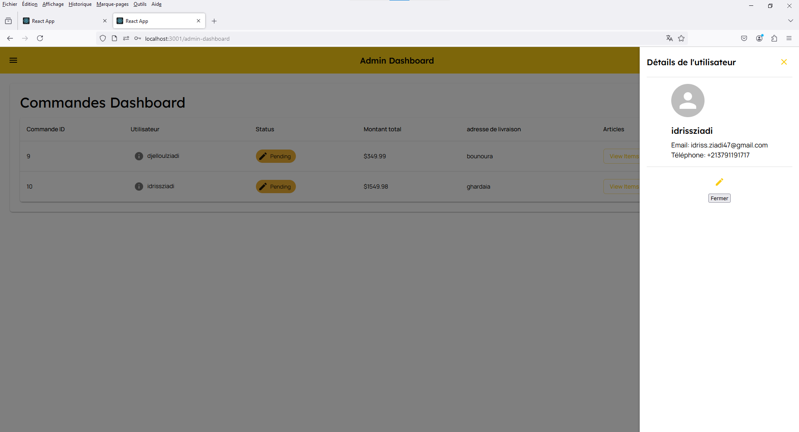

*Admin performing CRUD operations on products.*
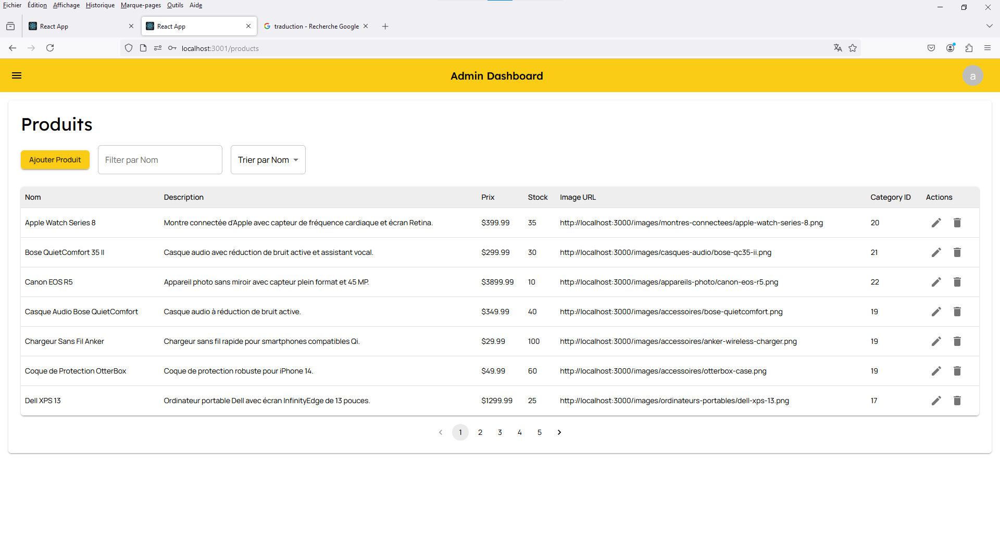
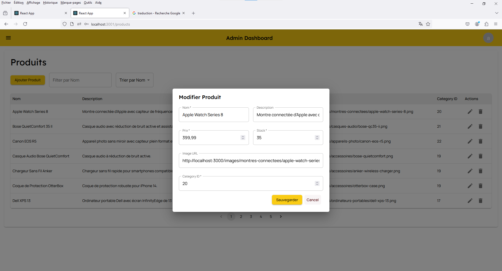

*Admin performing CRUD operations on users.*
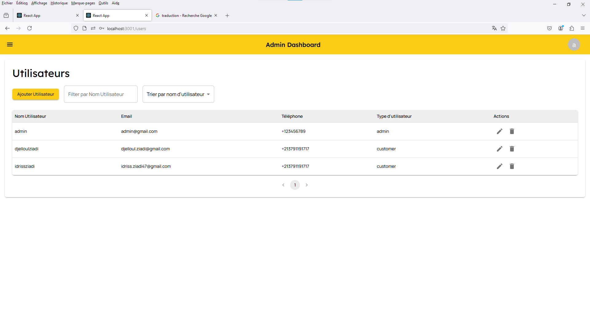


## Features

- **User Authentication**: Secure user sign-up and login.
- **Product Browsing**: Grid and list views of products with filtering options.
- **Shopping Cart**: Add items to cart, view order invoice, and print orders.
- **Admin Dashboard**: Manage products, orders, and users with full CRUD capabilities.
- **Responsive Design**: Built with Material-UI for a modern and responsive user experience.

## Installation

### Prerequisites

- Node.js
- MySQL

### Steps

1. Clone the repository:

   ```bash
      git clone https://github.com/idrissziadi/Ecommerce-App.git
      cd EcommerceApp
      
      # Installation des dépendances backend
      cd backend
      npm install
      
      # Configuration de la base de données MySQL
      # Assurez-vous que MySQL est installé et en cours d'exécution.
      
      # 1. Créez la base de données MySQL
      # Ouvrez MySQL dans votre terminal et exécutez la commande suivante :
      mysql -u root -p
      CREATE DATABASE ecommerce_app;
      
      # 2. Créez un utilisateur MySQL pour cette base de données :
      CREATE USER 'ecommerce_user'@'localhost' IDENTIFIED BY 'password';
      GRANT ALL PRIVILEGES ON ecommerce_app.* TO 'ecommerce_user'@'localhost';
      FLUSH PRIVILEGES;
      
      # 3. Configurez Sequelize pour se connecter à MySQL
      # Mettez à jour les informations de connexion dans le fichier backend/config/config.json :
      {
        "development": {
          "username": "ecommerce_user",
          "password": "password",
          "database": "ecommerce_app",
          "host": "127.0.0.1",
          "dialect": "mysql"
        }
      }
      
      # 4. Lancez les migrations Sequelize pour générer les tables dans la base de données :
      npx sequelize-cli db:migrate
      
      # Installation des dépendances frontend
      cd ../client
      npm install


