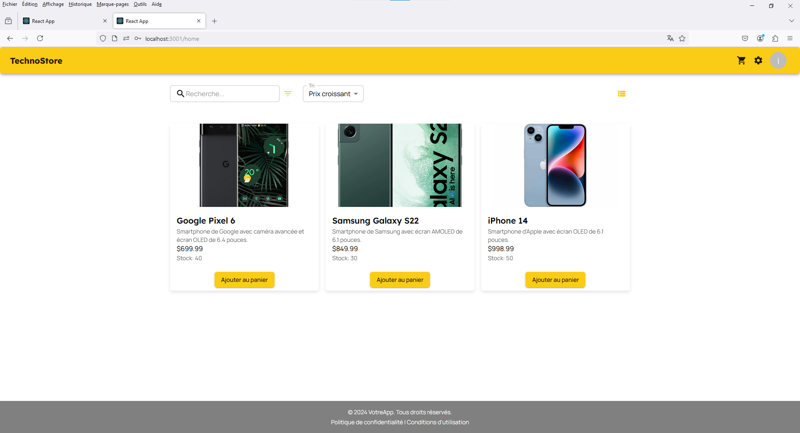

# EcommerceApp

EcommerceApp is a modern e-commerce application built using React, Node.js, Express, MySQL, Sequelize, and Material-UI. It provides users with the ability to browse products, manage their shopping cart, and place orders. The app also includes an admin panel for managing products, users, and orders.

## Screenshots


*Sign-up page for new customers.*


*Customer login page.*


*Categories displayed in a grid layout.*


*Categories displayed in a list layout.*


*Grid view of available products.*


*Product grid with a filter sidebar.*


*List view of available products.*


*Shopping cart showing added items.*


*Order invoice view.*


*Invoice printing page.*


*Admin login page.*


*Admin dashboard for managing orders and products.*


*Admin dashboard showing a list of orders.*


*Order details including user information.*


*Admin performing CRUD operations on products.*


*Admin performing CRUD operations on users.*

## Features

- **User Authentication**: Secure user sign-up and login.
- **Product Browsing**: Grid and list views of products with filtering options.
- **Shopping Cart**: Add items to cart, view order invoice, and print orders.
- **Admin Dashboard**: Manage products, orders, and users with full CRUD capabilities.
- **Responsive Design**: Built with Material-UI for a modern and responsive user experience.

## Installation

### Prerequisites

- Node.js
- MySQL

### Steps

1. Clone the repository:

   ```bash
   git clone https://github.com/idrissziadi/Ecommerce-App.git
   cd EcommerceApp
    cd backend
    npm install
    cd ../client
    npm install

